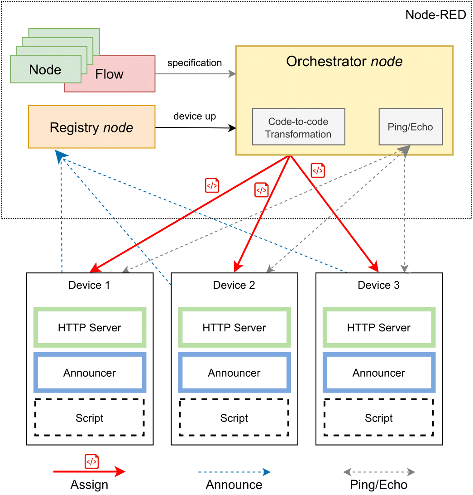

# Decentralized Node-RED

A modified Node-RED that takes advantage of the capabilities of the devices in the network. Related to my [dissertation](https://repositorio-aberto.up.pt/handle/10216/128520).

# Overview

In our solution, we use Node-RED for both (1) defining programs (as flows) and (2) orchestrate the decentralization and send tasks to other devices in the network, acting as an orchestration controller. The devices in the network make themselves known by announcing their address and capabilities to a registry *node* running in Node-RED. Consequently, Node-RED assigns *nodes* to devices taking into account their capabilities and communicates each node's assignment via HTTP. Due to the devices' limitations, they cannot run an instance of Node-RED, so Node-RED needs to translate the *nodes* code in JavaScript to another language that can be interpreted by these devices. 

Node-RED was modified to meet the distributed computation communication demands by replacing the built-in communication by an MQTT-based one. Two main components, as *nodes*, were introduced to the Node-RED Palette: (1) the *Registry node* which maintains a list of available devices and their capabilities and, (2) the *Orchestrator node* which partitions and assigns computation tasks to the available devices. Additionally, support was added to Node-RED to generate MicroPython-compatible code from custom *nodes*, *i.e.* code-to-code transformation.

Additionally, a MicroPython-based firmware was developed that can receive and run arbitrary Python code scripts generated by Node-RED, and communicate with other devices or Node-RED itself using MQTT. 

An high-level overview of the system can be seen in the figure below.

